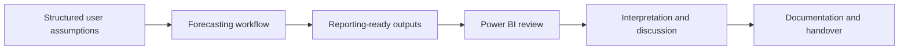

# AUT × Nestlé Forecasting KPI Reporting Project

A public, confidentiality-safe case study of an academic-industry collaboration focused on forecasting-oriented KPI reporting, Power BI prototyping, reporting assumptions, and handover documentation.

> **Public portfolio note**  
> This repository contains a written case study only. It does not contain Nestlé data, product-level information, internal figures, client files, source code, model outputs, or confidential screenshots.

## Project in one sentence

I contributed to a team project that connected forecasting outputs with a Power BI reporting workflow, helping make assumptions and reporting results easier to review and explain.

## What business problem the project addressed

The academic project explored how forecasting and reporting tools could support more forward-looking analysis and reduce reliance on manual spreadsheet-based review.

From a reporting perspective, the challenge was not only to produce forecasting outputs. The work also needed to make the reporting logic understandable, show how user inputs affected the output, and provide enough documentation for another person to continue the workflow.

## My contribution

My main contribution was on the reporting and integration side of the team project:

- led early Power BI prototyping for a forecasting-oriented reporting view
- helped connect user-selected assumptions and forecasting outputs into an interactive reporting workflow
- worked with Excel-based inputs used in the reporting process
- supported data-loading checks when the reporting view did not refresh as expected
- contributed to project communication, recommendations, and handover material
- explained reporting logic and workflow decisions in team presentations

This was a team project. I do not claim sole ownership of the overall forecasting solution, optimisation work, or other team deliverables.

## Tools used

- **Power BI** for dashboard prototyping and interactive reporting
- **Excel** for structured inputs and reporting handoff
- **Forecasting logic** as an input to the reporting workflow
- **Documentation** for assumptions, limitations, and continued use
- **Python** as a supporting part of the wider team workflow, not the main focus of this portfolio case study

## What this repository demonstrates

- reporting and dashboard thinking
- translating technical outputs into a business-facing view
- documenting assumptions and limitations
- checking data-loading and refresh issues
- contributing within an academic-industry team
- communicating technical workflow in plain English
- respecting confidentiality when presenting project evidence publicly

## Reporting workflow



The diagram is intentionally high level. It communicates the reporting process without exposing internal data structures, formulas, model parameters, or business-sensitive outputs.

## Public evidence available here

- project overview and reporting context
- clear statement of my individual contribution
- confidentiality-safe reporting workflow
- assumptions and limitations relevant to interpretation
- evidence map connecting the work to junior analyst capabilities
- recruiter-friendly summary of the project

## What is intentionally not included

- Nestlé or retailer datasets
- product, item, or category-level details
- prices, percentages, forecasts, accuracy metrics, or internal KPIs
- internal spreadsheets, database files, notebooks, or Power BI files
- client communications, names, feedback records, or meeting logs
- screenshots containing business information
- code or documents created by other team members

## Key documents

- [`docs/project-overview.md`](docs/project-overview.md) — project context and reporting objective
- [`docs/personal-contribution.md`](docs/personal-contribution.md) — what I personally worked on
- [`docs/reporting-workflow.md`](docs/reporting-workflow.md) — reporting process and design thinking
- [`docs/assumptions-and-limitations.md`](docs/assumptions-and-limitations.md) — interpretation boundaries
- [`docs/evidence-map.md`](docs/evidence-map.md) — connection to junior analyst skills
- [`docs/confidentiality-and-scope.md`](docs/confidentiality-and-scope.md) — public disclosure rules

## Repository structure

```text
aut-nestle-forecasting-kpi-reporting/
│
├── README.md
├── .gitignore
└── docs/
    ├── project-overview.md
    ├── personal-contribution.md
    ├── reporting-workflow.md
    ├── assumptions-and-limitations.md
    ├── evidence-map.md
    └── confidentiality-and-scope.md
```

## Positioning note

This was an AUT academic-industry collaboration, not professional employment. Nestlé is named only to identify the collaboration accurately. This repository is an independent personal portfolio summary and is not an official Nestlé publication, endorsement, or production system.

