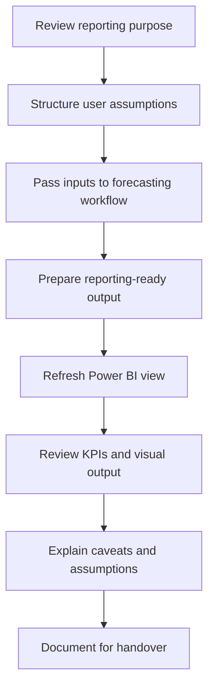

# Reporting Workflow

## High-level process

## 1. Review the reporting purpose

Before building visuals, the reporting question needs to be clear. The dashboard should help a user review a forecasting scenario rather than present technical model detail without context.

## 2. Structure user assumptions

Inputs need consistent formatting so that the downstream workflow can interpret them correctly. Excel supported this structured handoff in the prototype workflow.

## 3. Connect to the forecasting workflow

The reporting layer depended on forecasting outputs produced elsewhere in the team solution. My focus was on the connection and reporting experience rather than claiming ownership of every modelling component.

## 4. Prepare reporting-ready output

Technical output needs clear field names, usable structure, and reporting context before it can support a Power BI view.

## 5. Refresh and validate

When a report fails to load, the issue may come from the data or input layer rather than the visual itself. Checking the full path from input to report is part of reliable dashboard work.

## 6. Interpret and document

A reporting view should explain what the user selected, what the output represents, and what limitations affect interpretation. The final workflow also needs documentation so another person can understand and continue the work.

